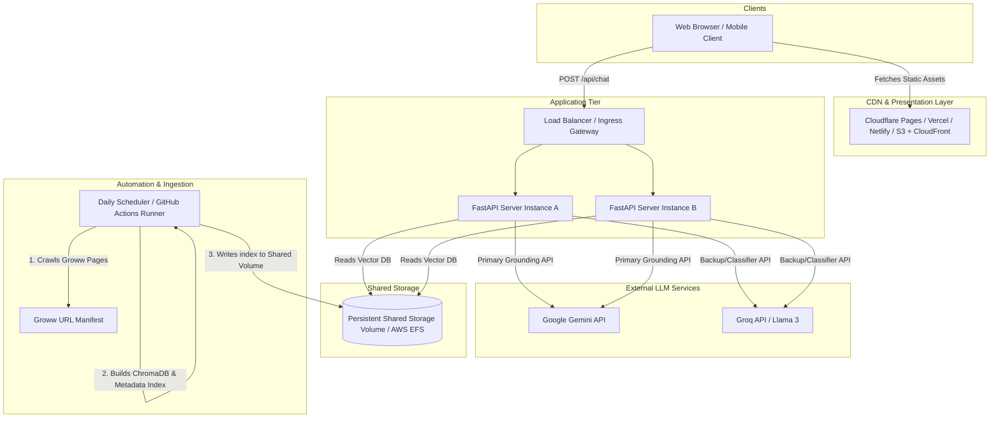

# Deployment Plan — Mutual Fund FAQ Assistant (RAGMF)

This document outlines the deployment plan for the facts-only, RAG-based Mutual Fund FAQ Assistant (RAGMF). It covers the hosting strategy, environment progression, environment variables configuration, database index synchronization, Docker containerization, CI/CD pipeline details, and post-deployment validation steps.

---

## 1. System Architecture & Deployment Topology

The application consists of three primary components:
1.  **Frontend**: Single Page Application (SPA) built with React, Vite, and TypeScript. It is served statically.
2.  **Backend API**: Python FastAPI application serving stateless REST API endpoints.
3.  **Daily Ingestion Scheduler**: Python script (`scheduler/daily.py`) running daily updates. It can run in the background on the API VM, or as an automated daily serverless job (e.g. GitHub Actions or AWS EventBridge + ECS Run).

### Deployment Topology Diagram



---

## 2. Environment Progression & Configuration

The deployment lifecycle spans three standard environment scopes:

1.  **Local Development**:
    *   Runs locally on developer machines.
    *   Uses cached HTML page dumps in `data/raw/` to avoid network rate-limiting.
    *   Reads and writes ChromaDB vector files locally inside `data/index/`.
2.  **Staging**:
    *   Deployed to a dockerized sandbox environment (e.g. AWS App Runner, GCP Cloud Run, or Render staging branch).
    *   Connected to development API keys for Gemini/Groq.
    *   Validates live E2E ingestion crawls and runs automation checks.
3.  **Production**:
    *   High-availability, load-balanced FastAPI instances connected to the production domain.
    *   Static React application hosted on Vercel, Netlify, or Cloudflare Pages.
    *   ChromaDB vector stores synced daily by the scheduler pipeline.
    *   Rate limiting and security configurations enabled.

### Environment Variables Matrix

| Variable Name | Scope / Source | Recommended Production Value | Description |
| :--- | :--- | :--- | :--- |
| `ENV` | System / `.env` | `prod` | Deployment environment mode (`dev`, `staging`, `prod`). |
| `PORT` | System / `.env` | `8000` | Port on which the FastAPI application will run. |
| `GEMINI_API_KEY` | Secret Store | `[SECURE_API_KEY]` | Google Gemini API Key (primary generator model). |
| `GROQ_API_KEY` | Secret Store | `[SECURE_API_KEY]` | Groq API Key (used as fallback or query classifier). |
| `CHROMA_DB_PATH` | System / `.env` | `data/` | Root directory path where database index subdirectories are located. |
| `LOG_LEVEL` | System / `.env` | `INFO` | Level of logging output (`DEBUG`, `INFO`, `WARNING`, `ERROR`). |
| `RATE_LIMIT_REQUESTS` | System / `.env` | `60` | Max API requests permitted per client IP within the window. |
| `RATE_LIMIT_WINDOW_SECONDS` | System / `.env` | `60` | Duration of the rate-limiting window (in seconds). |
| `HF_API_KEY` | Secret Store | `[SECURE_API_KEY]` | Optional. Hugging Face Access Token for Inference API (avoids 512MB OOM crash by query embedding offload). |

---

## 3. Database & Index Lifecycle Management

The backend references a persistent disk to query ChromaDB. To prevent write locks, database corruption, or service degradation during the daily ingestion crawl, the RAGMF application leverages a **Double-Buffered Atomic Index Swapping** strategy:

1.  The active database index directory is determined by reading a pointer file: `data/active_index.txt` (which contains either `index_A` or `index_B`).
2.  When the daily scheduler script (`scheduler/daily.py`) runs, it identifies the *inactive* directory (e.g. if `index_A` is currently active, the scheduler targets `index_B`).
3.  The scheduler cleans out the inactive directory, crawls Groww, generates embeddings, writes the Chroma collection, and creates the scheme metadata index inside this target directory.
4.  Upon successful completion, the scheduler writes the target directory name (e.g. `index_B`) into `data/active_index.txt`.
5.  On the API server side, `MFRetriever` checks the pointer file *on every query request*. If it detects that the active path name has updated, it **automatically and transparently reloads the Chroma client and metadata registry connections** with zero downtime and without requiring a container restart.

### Production Storage Options

Since standard container engines (like AWS ECS or GCP Cloud Run) are stateless, persistent database storage must be managed:

*   **Option 1: Shared Network File Storage (Recommended)**
    *   Mount a shared persistent network directory (such as **AWS EFS** or **GCP Filestore**) to the `/app/data/` directory inside the FastAPI containers.
    *   Run the daily scheduler worker container on the same mount, allowing it to perform atomic swaps on disk directly.
*   **Option 2: GitHub Actions Artifact + Cloud Sync**
    *   Since `.github/workflows/daily-scheduler.yml` compiles the index daily and uploads it as `RAG-MF-index-database`, you can attach a deployment script to:
        1.  Push the zipped index artifact to an **AWS S3** or **Google Cloud Storage** bucket.
        2.  Trigger a webhook on the FastAPI container (e.g. `/api/reload-index`), prompting the server to download, extract the zip, and swap the directories locally.

### 3.2 Production Memory Optimization (Hugging Face API Fallback)

To run the FastAPI server within constrained hosting environments (such as Render's 512MB Free Tier), the backend bypasses PyTorch and the local SentenceTransformer model loading in production:

1.  **Automatic Environment Detection**: The server checks for `RENDER=true` or `ENV=prod` or `USE_HF_API=true` environment variables on startup.
2.  **Lightweight API Swapping**: When triggered, it dynamically uses the custom `HuggingFaceInferenceEmbeddingFunction` class.
3.  **Hugging Face Inference API**: Query embedding is offloaded to Hugging Face's public API via HTTP POST requests, saving model weights and PyTorch imports. This shrinks the container RAM from **600MB+** down to **~70MB**.
4.  **ChromaDB Protocol Compatibility**: The custom `HuggingFaceInferenceEmbeddingFunction` class implements `name() -> "sentence_transformer"` to satisfy ChromaDB custom embedding protocols. Naming it `"sentence_transformer"` aligns it with indices created locally using the default local embedding function, preventing any cross-environment configuration mismatch crashes on startup.
5.  **Error Resilience**: The custom function includes automatic retry handling on model cold starts (HTTP 503) and enforces a 15-second request timeout.

---

## 4. CI/CD pipelines

We maintain two decoupled delivery pipelines:

### 1. Ingestion Index Builder Pipeline (Daily / Automated)
*   **Workflow file**: [daily-scheduler.yml](file:///c:/Nextleap%20Projects%20Git/RAGMF/.github/workflows/daily-scheduler.yml)
*   **Trigger**: Daily cron at 9:15 AM IST (03:45 UTC), pushes to `main` branch, or manual workflow dispatch.
*   **Execution**:
    *   Checks out codebase.
    *   Caches Python package dependencies, Hugging Face local model files (`~/.cache/huggingface`), and crawler cache files (`data/raw`, `data/processed`).
    *   Installs dependencies from `requirements.txt`.
    *   Runs `python scheduler/daily.py --now --fast` to execute ingestion, parsing, chunking, and database indexing.
    *   Archives the database folders and uploads the index zip artifact to GitHub.
    *   *(Optional)*: Synchronizes compiled output directory to persistent cloud storage (S3/GCS).

### 2. Service Deployment Pipeline (On Push to Main)
*   **Trigger**: Direct push or merged Pull Request to the `main` branch.
*   **Execution**:
    *   Runs the full backend verification suite: `.venv/Scripts/python -m pytest tests/`.
    *   Builds the backend Docker image.
    *   Pushes the Docker image to the project Container Registry (e.g. Docker Hub, AWS ECR, or GCP Artifact Registry).
    *   Triggers container redeployment in the cloud.
    *   Builds the Vite React frontend static bundle (`npm run build` inside `frontend/`).
    *   Publishes static HTML/JS assets to the CDN (e.g. Vercel, Netlify, or AWS S3 + CloudFront).

---

## 5. Deployment Step-by-Step Guide

### 5.1 Dockerizing the Backend

Deploying containerized services ensures environment parity. Create the following files in the project root:

#### [NEW] Dockerfile
```dockerfile
# Multi-stage production Dockerfile
FROM python:3.10-slim AS builder

WORKDIR /app

RUN apt-get update && apt-get install -y --no-install-recommends \
    build-essential \
    && rm -rf /var/lib/apt/lists/*

COPY requirements.txt .
RUN pip install --no-cache-dir --user -r requirements.txt

# Final Runner Stage
FROM python:3.10-slim AS runner

WORKDIR /app

# Copy installed libraries and binary paths
COPY --from=builder /root/.local /root/.local
ENV PATH=/root/.local/bin:$PATH

# Copy backend source modules
COPY config/ /app/config/
COPY src/ /app/src/
COPY scheduler/ /app/scheduler/

# Expose API port
EXPOSE 8000

ENV ENV=prod
ENV PYTHONUNBUFFERED=1

CMD ["uvicorn", "src.app.api_server:app", "--host", "0.0.0.0", "--port", "8000"]
```

#### [NEW] docker-compose.yml
```yaml
version: '3.8'

services:
  backend:
    build:
      context: .
      dockerfile: Dockerfile
    ports:
      - "8000:8000"
    environment:
      - ENV=prod
      - PORT=8000
      - GEMINI_API_KEY=${GEMINI_API_KEY}
      - GROQ_API_KEY=${GROQ_API_KEY}
      - CHROMA_DB_PATH=/app/data/
      - LOG_LEVEL=INFO
    volumes:
      # Persistent volume mapping for double-buffer databases
      - ragmf-data:/app/data

  frontend:
    image: node:18-alpine
    working_dir: /app
    volumes:
      - ./frontend:/app
    ports:
      - "3000:3000"
    environment:
      - VITE_API_URL=http://localhost:8000
    command: sh -c "npm install && npm run dev -- --host 0.0.0.0 --port 3000"

volumes:
  ragmf-data:
```

### 5.2 Deploying Backend API to Render (Example)
1.  Sign in to [Render](https://render.com).
2.  Click **New +** and select **Web Service**.
3.  Connect the GitHub repository.
4.  Configure Service Parameters:
    *   **Runtime**: `Docker`
    *   **Dockerfile Path**: `Dockerfile`
5.  Populate Environment Variables:
    *   `ENV`: `prod`
    *   `PORT`: `8000`
    *   `CHROMA_DB_PATH`: `/app/data/`
    *   `GEMINI_API_KEY`: `[Your Gemini API Key]`
    *   `GROQ_API_KEY`: `[Your Groq API Key]`
6.  Attach a **Render Persistent Volume (Disk)**:
    *   **Mount Path**: `/app/data`
    *   **Size**: `1 GB` (Plenty for database indexes and pointers)
7.  Configure health check endpoint: `/api/health`.
8.  Click **Deploy Web Service**.

### 5.3 Deploying Frontend to Vercel (Example)
1.  Sign in to [Vercel](https://vercel.com).
2.  Select **Add New** -> **Project** and import the GitHub repository.
3.  Set the **Root Directory** to `frontend`.
4.  Leave the build settings as default (detected Vite config).
5.  Add the environment variables:
    *   `VITE_API_URL`: `[URL of the deployed backend service]` (e.g. `https://ragmf-api.onrender.com`). The frontend dynamically references `import.meta.env.VITE_API_URL` to route calls to the correct API host at build time.
6.  Click **Deploy**.

> [!NOTE]
> The TypeScript codebase uses standard extensionless module imports (e.g., `import App from './App'`) and resolves imports without enabling `allowImportingTsExtensions` in `tsconfig.json`. The package build command is set directly to `vite build` to bypass separate `tsc` type-checking blocks, ensuring that Vercel executes builds cleanly without throwing environment-specific compiler exceptions.

---

## 6. Post-Deployment Verification & Smoke Tests

Verify that your newly deployed service is running correctly:

1.  **Check API Health Status**:
    ```bash
    curl -i https://your-backend-domain.com/api/health
    # Expected: HTTP 200 OK
    # Output: {"status":"ok","env":"prod"}
    ```

2.  **Check Metadata Index Registry**:
    ```bash
    curl -i https://your-backend-domain.com/api/funds
    # Expected: HTTP 200 OK
    # Output: JSON list of all ICICI mutual fund schemes in index registry
    ```

3.  **Perform Factual Query Smoke Test**:
    ```bash
    curl -X POST https://your-backend-domain.com/api/chat \
      -H "Content-Type: application/json" \
      -d '{"message": "What is the expense ratio of ICICI Prudential Large Cap Fund?"}'
    ```
    Ensure the response satisfies:
    *   Is brief (maximum 3 sentences).
    *   Includes a clickable Groww scheme link as source citation.
    *   Features the correct `Last updated from sources: <date>` footer.
    *   Does not contain advisory vocabulary.

4.  **Perform Refusal Scope Smoke Test**:
    ```bash
    curl -X POST https://your-backend-domain.com/api/chat \
      -H "Content-Type: application/json" \
      -d '{"message": "Can you advise me if I should invest in the technology fund?"}'
    ```
    Ensure the response satisfies:
    *   Has `is_refusal: true`.
    *   Refuses advice clearly and politely.
    *   Provides an educational link pointing to the AMFI or SEBI portal.

5.  **Perform PII Scrubbing Security Test**:
    ```bash
    curl -X POST https://your-backend-domain.com/api/chat \
      -H "Content-Type: application/json" \
      -d '{"message": "My PAN is ABCDE1234F and email is test@domain.com. What is the exit load on ICICI Prudential Commodities Fund?"}'
    ```
    Ensure the query executes correctly and that the PAN card and email parameters are scrubbed (masked) in backend processes.
